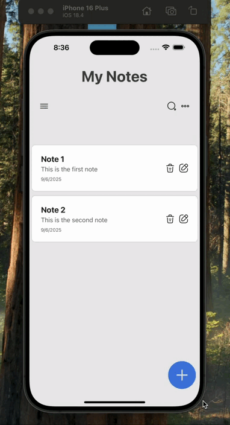

# React Native Note Project, "MyNotes"
This simple note-taking application helped me practice basic React Native concepts.

# 🔧 Technologies I Used:
* React Native (0.79.2)
  
* React Navigation (Native Stack)
  
* JavaScript
  
* Iconsax React Native

# 💡 What I Learned in This Project:
* Basic building blocks of React Native
  
* Setting up and using the navigation system
  
* Modern UI/UX principles
  
* Mobile application development processes

This project can be a good starting point for those who want to enter the React Native ecosystem. It's a project that provides the opportunity to practice basic concepts by developing a simple but effective application.

# Preview of the Project

